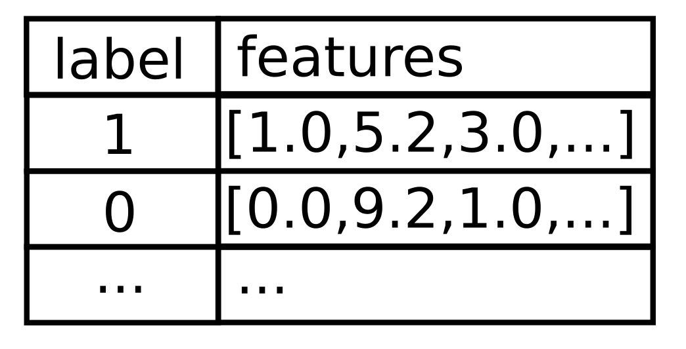

# **Features selection in spark**
How to use the tools provided by feature selector in spark

# *Feature selector*

## Vector slicer

An important thing to remember is that most models in the ml package from spark use a format based on two columns: one with a label and another with a vector of features (variables):




Vector slicer is a tool to choose the useful elements of the vector in the features column. It is useful If and only if you already know which are the useful features.

The following example comes from: https://github.com/adam-p/markdown-here/wiki/Markdown-Cheatsheet

```python
from pyspark.ml.feature import VectorSlicer
from pyspark.ml.linalg import Vectors
from pyspark.sql.types import Row

df = spark.createDataFrame([
    Row(userFeatures=Vectors.sparse(3, {0: -2.0, 1: 2.3})),
    Row(userFeatures=Vectors.dense([-2.0, 2.3, 0.0]))])

slicer = VectorSlicer(inputCol="userFeatures", outputCol="features", indices=[1])

output = slicer.transform(df)

output.select("userFeatures", "features").show()
```

## RFormula
Allows us to build the features for a model using an R formula. This makes authomatic binary categories which may not be useful if you know your data (seems very useful to automatize processes and make libraries but not for our current work.

## **ChiSqSelector**
